# Media Centre Helm Chart

A comprehensive Helm chart that deploys a complete media automation stack on Kubernetes, including VPN, downloaders, and media management applications.

## Overview

This umbrella chart installs and configures the following applications:

- **Gluetun** - VPN client to secure download traffic
- **SABnzbd** - Usenet downloader
- **qBittorrent** - Torrent downloader
- **Prowlarr** - Indexer manager and proxy
- **Sonarr** - TV show management
- **Radarr** - Movie management
- **Lidarr** - Music management
- **Readarr** - Book/eBook management
- **Bazarr** - Subtitle management

Each application includes optional monitoring via Exportarr for Prometheus metrics.

## Quick Overview

The media centre consists of three main layers working together:


### How It Works
1. **🔍 Prowlarr** finds content across multiple indexers and trackers
2. **📺 Management apps** (*arr suite) request downloads when content is found
3. **⬇️ Download clients** fetch content securely through VPN
4. **🔒 Gluetun** protects all download traffic through encrypted VPN tunnel

## Application Comparison

Choose which applications to enable based on your media automation needs:

| Application | Purpose | Essential? | Use Case | Enable When |
|-------------|---------|------------|----------|-------------|
| **🔒 Gluetun** | VPN protection | ⭐ **Highly Recommended** | Secure download traffic | You want privacy protection |
| **🔍 Prowlarr** | Indexer management | ⭐ **Essential** | Central indexer configuration | Always (required for automation) |
| **📺 Sonarr** | TV show automation | ⭐ **Core** | Automated TV series management | You watch TV shows |
| **🎬 Radarr** | Movie automation | ⭐ **Core** | Automated movie management | You watch movies |
| **🎵 Lidarr** | Music automation | 🔧 **Optional** | Automated music collection | You collect music/albums |
| **📚 Readarr** | Book automation | 🔧 **Optional** | eBook/audiobook management | You read digital books |
| **💬 Bazarr** | Subtitle management | 🔧 **Optional** | Automatic subtitle downloads | You need subtitles |
| **📥 SABnzbd** | Usenet downloader | ⭐ **Recommended** | Fast, reliable downloads | You have Usenet access |
| **🌊 qBittorrent** | Torrent downloader | 🔧 **Alternative** | P2P downloads | You use torrents |

### Recommended Configurations

**🚀 Starter Setup** (Essential only):
```yaml
gluetun: enabled: true      # VPN protection
prowlarr: enabled: true    # Indexer management  
sonarr: enabled: true      # TV shows
radarr: enabled: true      # Movies
sabnzbd: enabled: true     # Downloads
qbittorrent: enabled: false
lidarr: enabled: false
readarr: enabled: false
bazarr: enabled: false
```

**🎯 Complete Media Setup** (Most users):
```yaml
# Enable all core applications
gluetun: enabled: true
prowlarr: enabled: true
sonarr: enabled: true
radarr: enabled: true
bazarr: enabled: true      # Automatic subtitles
sabnzbd: enabled: true
qbittorrent: enabled: true # Both downloaders
lidarr: enabled: false     # Add if you manage music
readarr: enabled: false    # Add if you read ebooks
```

**🎶 Everything Setup** (Power users):
```yaml
# All applications enabled
# Perfect for comprehensive media automation
```

### Resource Planning

| Setup Type | CPU Requirement | RAM Requirement | Storage Need |
|------------|----------------|-----------------|--------------|
| **Starter** | 1-2 cores | 4-6 GB | 1-2 TB |
| **Complete** | 2-4 cores | 6-8 GB | 3-5 TB |
| **Everything** | 4-6 cores | 8-12 GB | 5-10 TB |

## Architecture

The following diagram shows how all components work together in the media automation stack:


### Component Relationships

| Component | Purpose | Communicates With |
|-----------|---------|-------------------|
| **Gluetun** | VPN gateway protecting download traffic | Internet, SABnzbd, qBittorrent |
| **Prowlarr** | Indexer management and API proxy | External indexers, all *arr apps |
| **SABnzbd** | Usenet (NZB) downloader | Gluetun (via VPN), all *arr apps |
| **qBittorrent** | Torrent downloader | Gluetun (via VPN), all *arr apps |
| **Sonarr** | TV show automation | Prowlarr, downloaders, shared storage |
| **Radarr** | Movie automation | Prowlarr, downloaders, shared storage |
| **Lidarr** | Music automation | Prowlarr, downloaders, shared storage |
| **Readarr** | Book automation | Prowlarr, downloaders, shared storage |
| **Bazarr** | Subtitle management | Sonarr, Radarr, shared storage |
| **Exportarr** | Metrics exporter | All *arr apps, Prometheus |

### Data Flow

1. **Discovery**: Prowlarr manages indexer connections and provides search capabilities
2. **Search**: Media management apps (*arr) search through Prowlarr for content
3. **Download**: Download requests are sent to SABnzbd or qBittorrent via VPN
4. **Processing**: Downloaded content is processed and moved to appropriate media directories
5. **Enhancement**: Bazarr adds subtitles to video content post-processing
6. **Monitoring**: Exportarr collects metrics from all applications for observability

### Workflow Process

The following diagram illustrates the typical user workflow and automated processes:


### User Journey Steps

1. **Initial Setup**: Configure indexers in Prowlarr, set up download clients
2. **Content Request**: Add desired TV shows/movies to Sonarr/Radarr
3. **Automated Search**: Applications automatically search for content via Prowlarr
4. **Secure Download**: Content is downloaded through VPN-protected clients
5. **Processing**: Files are organized, renamed, and moved to media libraries
6. **Enhancement**: Subtitles are automatically added to video content
7. **Monitoring**: Track system health and download statistics via metrics

### Network Security Architecture

The following diagram shows how VPN protection secures download traffic:

```mermaid
flowchart TD
    subgraph Internet["🌐 Internet"]
        ISP[ISP/Internet]
        VPNP[VPN Provider]
        IDX[Indexers & Trackers]
    end
    
    subgraph Cluster["☸️ Kubernetes Cluster"]
        subgraph VPNPod["VPN Pod"]
            GLU[Gluetun VPN]
        end
        
        subgraph DownloadPods["Download Pods"]
            SAB[SABnzbd]
            QBT[qBittorrent]
        end
        
        subgraph ManagementPods["Management Pods"]
            PRO[Prowlarr]
            SON[Sonarr]
            RAD[Radarr]
            LID[Lidarr]
            REA[Readarr]
            BAZ[Bazarr]
        end
        
        subgraph Storage["💾 Storage"]
            MED[Media Storage]
            DOW[Download Storage]
        end
    end
    
    subgraph Home["🏠 Home Network"]
        USER[User]
    end
    
    %% VPN Traffic (Encrypted)
    ISP -.->|🔒 Encrypted VPN Tunnel| VPNP
    VPNP -.->|🔒 Encrypted Traffic| GLU
    GLU -->|🛡️ VPN Protected| SAB
    GLU -->|🛡️ VPN Protected| QBT
    
    %% Direct Management Traffic
    USER -->|Direct Access| PRO
    USER -->|Direct Access| SON
    USER -->|Direct Access| RAD
    
    %% Indexer Communication
    PRO <-->|API Calls| IDX
    PRO --> SON
    PRO --> RAD
    PRO --> LID
    PRO --> REA
    
    %% Download Requests
    SON -->|Download Requests| SAB
    SON -->|Download Requests| QBT
    RAD -->|Download Requests| SAB
    RAD -->|Download Requests| QBT
    LID -->|Download Requests| SAB
    LID -->|Download Requests| QBT
    REA -->|Download Requests| SAB
    REA -->|Download Requests| QBT
    
    %% Storage Access
    SAB -->|Save Downloads| DOW
    QBT -->|Save Downloads| DOW
    SON <-->|Organize Media| MED
    RAD <-->|Organize Media| MED
    LID <-->|Organize Media| MED
    REA <-->|Organize Media| MED
    BAZ <-->|Add Subtitles| MED
    
    %% Subtitle Integration
    BAZ <--> SON
    BAZ <--> RAD
    
    %% Styling
    classDef vpnSecure fill:#c8e6c9,stroke:#4caf50,stroke-width:3px
    classDef download fill:#ffecb3,stroke:#ff9800,stroke-width:2px
    classDef management fill:#e3f2fd,stroke:#2196f3,stroke-width:2px
    classDef storage fill:#f3e5f5,stroke:#9c27b0,stroke-width:2px
    classDef external fill:#ffebee,stroke:#f44336,stroke-width:2px
    
    class GLU,SAB,QBT vpnSecure
    class PRO,SON,RAD,LID,REA,BAZ management
    class MED,DOW storage
    class ISP,VPNP,IDX external
```



#### Security Benefits

- **Download Traffic Protection**: All download traffic (SABnzbd, qBittorrent) routes through VPN
- **IP Masking**: Your real IP address is hidden from indexers and trackers
- **ISP Privacy**: Download activity is encrypted and hidden from your ISP
- **Kill Switch**: If VPN disconnects, download clients lose internet access
- **Split Tunneling**: Management interfaces remain directly accessible for configuration

#### Network Isolation Levels

| Component | Network Access | Security Level |
|-----------|---------------|----------------|
| **Download Clients** | VPN Only | 🔒 High - All traffic encrypted |
| **Management Apps** | Direct + Internal | 🔓 Medium - Local cluster access |
| **Storage** | Internal Only | 🔒 High - No external access |
| **VPN Gateway** | Internet + VPN | 🔒 High - Encrypted tunnel |

## Prerequisites

- Kubernetes 1.19+
- Helm 3.2.0+
- A storage class that supports `ReadWriteMany` access mode for shared media storage
- VPN credentials (if using Gluetun)

## Installation

### Add the Helm Repository

```bash
helm repo add your-charts https://your-org.github.io/charts
helm repo update
```

### Install the Chart

```bash
# Basic installation with default values
helm install media-centre your-charts/media-centre

# Install with custom values
helm install media-centre your-charts/media-centre -f values.yaml

# Install in a specific namespace
helm install media-centre your-charts/media-centre --namespace media --create-namespace
```

## Configuration

### Global Configuration

| Parameter | Description | Default |
|-----------|-------------|---------|
| `global.storageClass` | Default storage class for all PVCs | `""` |
| `global.media.enabled` | Enable shared media storage | `true` |
| `global.media.size` | Size of shared media storage | `1Ti` |
| `global.media.storageClass` | Storage class for media volumes | `""` |
| `global.downloads.enabled` | Enable shared downloads storage | `true` |
| `global.downloads.size` | Size of downloads storage | `500Gi` |
| `global.network.useVPN` | Route download clients through VPN | `true` |

### NFS Configuration

| Parameter | Description | Default |
|-----------|-------------|---------|
| `<app>.persistence.<volume>.nfs.enabled` | Enable NFS for this volume | `false` |
| `<app>.persistence.<volume>.nfs.server` | NFS server IP address | `""` |
| `<app>.persistence.<volume>.nfs.path` | NFS export path | `""` |
| `<app>.persistence.<volume>.nfs.mountOptions` | NFS mount options | `[nfsvers=4.1, hard, intr]` |
| `<app>.persistence.<volume>.existingClaim` | Use existing PVC instead of creating new | `""` |
| `<app>.persistence.<volume>.size` | Volume size (resource request for NFS) | Varies by app |

**Note**: With NFS, `size` is a Kubernetes resource request, not actual storage allocation. Actual capacity comes from your NFS export.

### VPN Configuration (Gluetun)

| Parameter | Description | Default |
|-----------|-------------|---------|
| `gluetun.enabled` | Enable Gluetun VPN | `true` |
| `gluetun.env.VPN_SERVICE_PROVIDER` | VPN provider | `nordvpn` |
| `gluetun.env.VPN_TYPE` | VPN protocol type | `openvpn` |
| `gluetun.env.OPENVPN_USER` | VPN username | `""` |
| `gluetun.env.OPENVPN_PASSWORD` | VPN password | `""` |

### Application Configuration

Each application can be enabled/disabled and configured independently:

| Parameter | Description | Default |
|-----------|-------------|---------|
| `<app>.enabled` | Enable the application | `true` |
| `<app>.image.repository` | Container image repository | `lscr.io/linuxserver/<app>` |
| `<app>.image.tag` | Container image tag | `latest` |
| `<app>.env.TZ` | Timezone | `UTC` |
| `<app>.env.PUID` | User ID | `1000` |
| `<app>.env.PGID` | Group ID | `1000` |
| `<app>.exportarr.enabled` | Enable monitoring | `true` |

## Quick Start Examples

### Basic Installation

```yaml
# values.yaml
global:
  storageClass: "fast-ssd"
  media:
    size: 2Ti
  downloads:
    size: 1Ti

gluetun:
  env:
    VPN_SERVICE_PROVIDER: "nordvpn"
    OPENVPN_USER: "your-username"
    OPENVPN_PASSWORD: "your-password"
```

### Disable Specific Applications

```yaml
# values.yaml
# Only install downloaders and TV/Movie management
lidarr:
  enabled: false
readarr:
  enabled: false
bazarr:
  enabled: false
```

### Custom Storage Configuration

```yaml
# values.yaml
global:
  media:
    existingClaim: "existing-media-pvc"
  downloads:
    existingClaim: "existing-downloads-pvc"

sonarr:
  persistence:
    media:
      existingClaim: "tv-shows-pvc"

radarr:
  persistence:
    media:
      existingClaim: "movies-pvc"
```

### Without VPN

```yaml
# values.yaml
global:
  network:
    useVPN: false

gluetun:
  enabled: false

# Remove VPN annotations from downloaders
sabnzbd:
  podAnnotations: {}

qbittorrent:
  podAnnotations: {}
```

## NFS Setup Guide

### Prerequisites for NFS

Before using NFS storage, ensure you have:
- A NAS device or NFS server (Synology, QNAP, TrueNAS, etc.)
- Network connectivity between Kubernetes nodes and NFS server
- Proper NFS exports configured on your server

### Step 1: Configure NFS Server

#### On Synology NAS:
1. Go to **Control Panel** → **Shared Folder**
2. Create folders: `media`, `downloads`
3. Go to **Control Panel** → **File Services** → **NFS**
4. Enable NFS service
5. Edit each shared folder → **NFS Permissions**:
   - Hostname/IP: `192.168.1.0/24` (adjust for your network)
   - Privilege: `Read/Write`
   - Squash: `No mapping`
   - Security: `sys`
   - Enable `Allow connections from non-privileged ports`

#### Manual NFS Server Configuration:
```bash
# Create directories on NFS server
sudo mkdir -p /srv/nfs/media/{movies,tv,music,books}
sudo mkdir -p /srv/nfs/downloads

# Set ownership (important for media apps)
sudo chown -R 1000:1000 /srv/nfs/media
sudo chown -R 1000:1000 /srv/nfs/downloads

# Configure exports (/etc/exports)
echo "/srv/nfs/media    192.168.1.0/24(rw,sync,no_subtree_check,no_root_squash)" >> /etc/exports
echo "/srv/nfs/downloads 192.168.1.0/24(rw,sync,no_subtree_check,no_root_squash)" >> /etc/exports

# Apply configuration
sudo exportfs -rav
sudo systemctl restart nfs-kernel-server
```

### Step 2: Prepare Kubernetes Nodes

Install NFS client on all Kubernetes nodes:

```bash
# Ubuntu/Debian
sudo apt-get update
sudo apt-get install nfs-common

# CentOS/RHEL/Rocky Linux
sudo yum install nfs-utils

# Enable and start required services
sudo systemctl enable rpc-bind
sudo systemctl start rpc-bind
```

### Step 3: Test NFS Connectivity

Verify NFS connectivity from each Kubernetes node:

```bash
# Test mount
sudo mkdir -p /mnt/test
sudo mount -t nfs4 192.168.1.100:/volume1/media /mnt/test

# Verify access
ls -la /mnt/test
touch /mnt/test/test-file
rm /mnt/test/test-file

# Unmount
sudo umount /mnt/test
```

### Step 4: Configure Media Centre with NFS

Use the NFS example configuration:

```bash
# Install with NFS configuration
helm install media-centre ./charts/incubator/media-centre \
  -f examples/values-nfs.yaml \
  -n media --create-namespace
```

### NFS Configuration Examples

#### Basic NFS Setup:
```yaml
# Single NFS server for all media
sonarr:
  persistence:
    tv:
      enabled: true
      size: 5Ti  # Realistic sizing - match your NFS export capacity
      accessMode: ReadWriteMany
      nfs:
        enabled: true
        server: "192.168.1.100"
        path: "/volume1/media/tv"  # Actual capacity determined by NFS export
        mountOptions:
          - nfsvers=4.1
          - hard
          - intr
          - rsize=1048576
          - wsize=1048576

radarr:
  persistence:
    movies:
      enabled: true
      size: 8Ti  # Set based on actual NFS export size
      accessMode: ReadWriteMany
      nfs:
        enabled: true
        server: "192.168.1.100"
        path: "/volume1/media/movies"  # NFS export determines real capacity
        mountOptions:
          - nfsvers=4.1
          - hard
          - intr
```

#### Hybrid Storage Strategy:
```yaml
# Fast local storage for configs, NFS for media
sonarr:
  persistence:
    config:
      enabled: true
      size: 5Gi
      storageClass: "local-path"  # Fast local storage
      accessMode: ReadWriteOnce
    tv:
      enabled: true
      nfs:
        enabled: true
        server: "192.168.1.100"
        path: "/volume1/media/tv"
```

#### Multiple NFS Servers:
```yaml
# Different servers for different media types
radarr:
  persistence:
    movies:
      nfs:
        enabled: true
        server: "192.168.1.100"  # Main NAS
        path: "/volume1/movies"

lidarr:
  persistence:
    music:
      nfs:
        enabled: true
        server: "192.168.1.101"  # Music-specific server
        path: "/music-library"
```

#### Using Existing NFS PVCs:
```yaml
# Reference manually created PVCs
sonarr:
  persistence:
    tv:
      enabled: true
      existingClaim: "shared-tv-nfs-pvc"
    downloads:
      enabled: true
      existingClaim: "shared-downloads-nfs-pvc"
```

### NFS Volume Sizing Strategy

When using NFS, the `size` parameter has a different meaning than with dynamic storage:

#### Understanding NFS Volume Sizes
- **With StorageClass**: Size allocates actual storage capacity
- **With NFS**: Size is a resource request/limit for Kubernetes quotas
- **Actual capacity**: Determined by your NFS export, not the PVC size

#### Recommended Sizing Approaches

**Realistic Sizing (Recommended)**:
```yaml
# Match PVC size to actual NFS export capacity
movies:
  size: 8Ti    # Your NFS export is 10TB, leave 2TB headroom
  nfs:
    enabled: true
    path: "/volume1/movies"  # 10TB NFS export
```

**Generous Sizing**:
```yaml
# Use large values for unlimited/expandable NFS storage
movies:
  size: 100Ti  # Large request, actual limit from NFS export
  nfs:
    enabled: true
    path: "/volume1/movies"
```

**Minimal Sizing**:
```yaml
# Use small requests for quota management or testing
movies:
  size: 1Gi    # Minimal request, NFS provides actual capacity
  nfs:
    enabled: true
    path: "/volume1/movies"
```

### Optimized NFS Mount Options

For different use cases, consider these mount options:

#### High Performance (Gigabit+ Network):
```yaml
mountOptions:
  - nfsvers=4.1
  - hard
  - intr
  - rsize=1048576    # 1MB read size
  - wsize=1048576    # 1MB write size
  - timeo=600        # 60 second timeout
  - retrans=2        # 2 retransmissions
  - proto=tcp        # Use TCP
```

#### Reliability Focused:
```yaml
mountOptions:
  - nfsvers=4.1
  - hard             # Wait for server recovery
  - intr             # Allow interruption
  - timeo=150        # 15 second timeout
  - retrans=3        # More retries
  - ac               # Enable attribute caching
```

#### Low Bandwidth Network:
```yaml
mountOptions:
  - nfsvers=4.1
  - hard
  - intr
  - rsize=65536      # 64KB read size
  - wsize=65536      # 64KB write size
  - timeo=300        # Longer timeout
```

## Post-Installation Setup

### 1. Access Applications

After installation, each application will be available at its service port:

- **Gluetun**: `http://<cluster-ip>:8000`
- **SABnzbd**: `http://<cluster-ip>:8080`
- **qBittorrent**: `http://<cluster-ip>:8080`
- **Prowlarr**: `http://<cluster-ip>:9696`
- **Sonarr**: `http://<cluster-ip>:8989`
- **Radarr**: `http://<cluster-ip>:7878`
- **Lidarr**: `http://<cluster-ip>:8686`
- **Readarr**: `http://<cluster-ip>:8787`
- **Bazarr**: `http://<cluster-ip>:6767`

### 2. Configure Indexers

1. Set up indexers in **Prowlarr** first
2. Use Prowlarr's integration to automatically configure indexers in other applications

### 3. Configure Download Clients

1. In each *arr application, add download clients:
   - **SABnzbd**: `http://sabnzbd:8080`
   - **qBittorrent**: `http://qbittorrent:8080`

### 4. Set Up Media Directories

Configure consistent media paths across applications:
- **TV Shows**: `/tv`
- **Movies**: `/movies`
- **Music**: `/music`
- **Books**: `/books`

## Monitoring

Each application includes optional Exportarr monitoring that exports metrics to Prometheus:

```yaml
# Enable monitoring for all applications
sonarr:
  exportarr:
    enabled: true

radarr:
  exportarr:
    enabled: true
# ... etc
```

Metrics are available at `http://<app>:9707/metrics`

## Storage Considerations

### Shared Storage

The chart is designed to work with shared storage (ReadWriteMany) for media files, allowing multiple applications to access the same media library.

### Storage Classes

Consider using different storage classes for different types of data:
- Fast SSD for application configs and databases
- Slower bulk storage for media files
- High-performance storage for download directories

## Security Considerations

### VPN Configuration

- Always use a VPN for download clients to protect privacy
- Store VPN credentials in Kubernetes secrets
- Configure VPN kill-switch to prevent traffic leakage

### Network Policies

Consider implementing network policies to:
- Isolate download clients to VPN-only traffic
- Restrict management application access
- Control inter-application communication

## Setup Guide

### Step 1: Prepare Your Environment

Before installing the media centre, ensure you have:

```bash
# Verify Kubernetes cluster is ready
kubectl cluster-info

# Check available storage classes
kubectl get storageclass

# Create namespace for media centre
kubectl create namespace media
```

### Step 2: Configure VPN (Recommended)

Create a secret with your VPN credentials:

```bash
# Create VPN credentials secret
kubectl create secret generic vpn-credentials \
  --from-literal=username='your-vpn-username' \
  --from-literal=password='your-vpn-password' \
  -n media
```

Update your values file to use the secret:

```yaml
gluetun:
  env:
    OPENVPN_USER:
      valueFrom:
        secretKeyRef:
          name: vpn-credentials
          key: username
    OPENVPN_PASSWORD:
      valueFrom:
        secretKeyRef:
          name: vpn-credentials
          key: password
```

### Step 3: Install the Chart

```bash
# Install with default values
helm install media-centre ./charts/incubator/media-centre -n media

# Or install with custom configuration
helm install media-centre ./charts/incubator/media-centre -f values.yaml -n media
```

### Step 4: Access Applications

```bash
# Port forward to access applications locally
kubectl port-forward svc/media-centre-prowlarr 9696:9696 -n media
kubectl port-forward svc/media-centre-sonarr 8989:8989 -n media
kubectl port-forward svc/media-centre-radarr 7878:7878 -n media
```

### Step 5: Initial Configuration

1. **Configure Prowlarr** (http://localhost:9696):
   - Add your preferred indexers
   - Configure API keys for integration
   - Test indexer connections

2. **Setup Sonarr** (http://localhost:8989):
   - Add Prowlarr as indexer source
   - Configure download clients (SABnzbd/qBittorrent)
   - Set media library paths
   - Configure quality profiles

3. **Setup Radarr** (http://localhost:7878):
   - Add Prowlarr as indexer source
   - Configure download clients
   - Set movie library paths
   - Configure quality profiles

4. **Configure Download Clients**:
   - SABnzbd: Configure your Usenet provider
   - qBittorrent: No additional setup required

## Troubleshooting

### Common Issues

#### 1. NFS Mount Failures

**Problem**: Pods fail to start with NFS mount errors

```bash
# Check pod events
kubectl describe pod <pod-name> -n media
```

**Solutions**:
- Verify NFS server is accessible: `ping 192.168.1.100`
- Test manual NFS mount from nodes
- Check NFS exports: `showmount -e 192.168.1.100`
- Ensure nfs-common is installed on all nodes
- Verify firewall rules allow NFS traffic (ports 111, 2049)

#### 2. NFS Permission Issues

**Problem**: Applications can't write to NFS shares

```bash
# Check NFS mount permissions in pod
kubectl exec -it <pod-name> -n media -- ls -la /movies
kubectl exec -it <pod-name> -n media -- touch /movies/test.txt
```

**Solutions**:
- Set correct ownership on NFS server: `chown -R 1000:1000 /path/to/export`
- Use `no_root_squash` in NFS exports
- Verify PUID/PGID in application configuration
- Check fsGroup in pod security context

#### 3. NFS Performance Issues

**Problem**: Slow file operations or timeouts

**Solutions**:
- Increase rsize/wsize in mount options
- Use NFSv4.1 instead of older versions
- Enable attribute caching with `ac` mount option
- Check network bandwidth and latency
- Consider using local storage for active downloads

#### 4. NFS Connection Timeouts

**Problem**: Applications lose connection to NFS server

```bash
# Check NFS client statistics
kubectl exec -it <pod-name> -n media -- cat /proc/mounts | grep nfs
kubectl exec -it <pod-name> -n media -- nfsstat -c
```

**Solutions**:
- Increase timeo value in mount options
- Use `hard` mount option to retry indefinitely
- Check network stability between nodes and NFS server
- Verify NFS server has sufficient resources

#### 5. Pods Stuck in Pending State

**Problem**: Pods not starting due to storage issues

```bash
# Check pod status
kubectl get pods -n media
kubectl describe pod <pod-name> -n media
```

**Solutions**:
- Verify storage class exists and supports ReadWriteMany
- Check if persistent volume claims are bound
- Ensure sufficient storage capacity

#### 2. VPN Connection Failures

**Problem**: Download clients can't connect through VPN

```bash
# Check Gluetun logs
kubectl logs -f deployment/media-centre-gluetun -n media
```

**Solutions**:
- Verify VPN credentials are correct
- Check VPN provider settings
- Ensure VPN provider supports your region
- Try different VPN servers

#### 3. Applications Can't Reach Each Other

**Problem**: Sonarr/Radarr can't connect to download clients

**Solutions**:
- Use service names instead of localhost:
  - SABnzbd: `http://media-centre-sabnzbd:8080`
  - qBittorrent: `http://media-centre-qbittorrent:8080`
- Check network policies aren't blocking traffic
- Verify service ports match container ports

#### 4. Storage Permission Issues

**Problem**: Applications can't write to storage

```bash
# Check pod file permissions
kubectl exec -it <pod-name> -n media -- ls -la /media
kubectl exec -it <pod-name> -n media -- id
```

**Solutions**:
- Ensure PUID/PGID match filesystem permissions
- Check storage class supports required access modes
- Verify volume mount paths are correct

#### 5. Download Clients Not Working

**Problem**: Downloads failing or not starting

**For SABnzbd**:
```bash
# Check SABnzbd logs
kubectl logs -f deployment/media-centre-sabnzbd -n media
```
- Verify Usenet provider configuration
- Check server settings and SSL configuration
- Ensure sufficient disk space

**For qBittorrent**:
```bash
# Check qBittorrent logs
kubectl logs -f deployment/media-centre-qbittorrent -n media
```
- Verify port forwarding through VPN
- Check tracker connectivity
- Ensure proper ratio management

#### 6. Multiple Applications Sharing NFS

**Problem**: File conflicts or locking issues with shared NFS storage

**Solutions**:
- Use subdirectories for each application
- Configure atomic moves in download clients
- Use separate NFS exports for different applications
- Enable file locking if supported by NFS server

#### 7. Monitoring Not Working

**Problem**: Exportarr metrics not available

```bash
# Check exportarr sidecar
kubectl logs <pod-name> -c exportarr -n media
```

**Solutions**:
- Verify API keys are configured
- Check application URLs in exportarr config
- Ensure applications are fully started before exportarr

### Checking Logs

```bash
# Check all pods status
kubectl get pods -n media

# Check specific application logs
kubectl logs -f deployment/media-centre-sonarr -n media
kubectl logs -f deployment/media-centre-radarr -n media
kubectl logs -f deployment/media-centre-prowlarr -n media

# Check VPN logs
kubectl logs -f deployment/media-centre-gluetun -n media

# Check download client logs
kubectl logs -f deployment/media-centre-sabnzbd -n media
kubectl logs -f deployment/media-centre-qbittorrent -n media

# Check events for troubleshooting
kubectl get events -n media --sort-by='.lastTimestamp'
```

### NFS Troubleshooting Commands

```bash
# Check NFS server exports
showmount -e 192.168.1.100

# Test NFS connectivity
rpcinfo -p 192.168.1.100

# Check NFS client status in pod
kubectl exec -it <pod-name> -n media -- mount | grep nfs
kubectl exec -it <pod-name> -n media -- df -h

# Monitor NFS performance
kubectl exec -it <pod-name> -n media -- iostat -x 1

# Check NFS client statistics
kubectl exec -it <pod-name> -n media -- nfsstat -c

# Verify file permissions
kubectl exec -it <pod-name> -n media -- ls -la /media
kubectl exec -it <pod-name> -n media -- id
```

### Performance Optimization

#### NFS Performance Tuning

```yaml
# Optimize NFS mount options for performance
persistence:
  movies:
    nfs:
      mountOptions:
        - nfsvers=4.1
        - proto=tcp
        - hard
        - intr
        - rsize=1048576      # Large read buffer
        - wsize=1048576      # Large write buffer
        - timeo=600          # 60 second timeout
        - retrans=2
        - ac                 # Enable attribute caching
        - actimeo=30         # Cache attributes for 30 seconds
```

#### Storage Strategy for Performance

```yaml
# Use local storage for configs and active downloads
# Use NFS for media libraries (read-mostly)
sabnzbd:
  persistence:
    config:
      storageClass: "local-path"  # Fast local SSD
    incomplete:
      storageClass: "local-path"  # Active downloads on local storage
    downloads:
      nfs:
        enabled: true             # Completed downloads on NFS
```

#### Resource Allocation

```yaml
# Example resource limits
sonarr:
  resources:
    requests:
      memory: "512Mi"
      cpu: "100m"
    limits:
      memory: "2Gi"
      cpu: "1000m"

radarr:
  resources:
    requests:
      memory: "512Mi"
      cpu: "100m"
    limits:
      memory: "2Gi"
      cpu: "1000m"
```

#### Storage Optimization

```yaml
# Use different storage classes for different purposes
global:
  storageClass: "fast-ssd"  # For application configs
  media:
    storageClass: "bulk-storage"  # For media files
  downloads:
    storageClass: "fast-ssd"  # For active downloads
```

### Maintenance Tasks

#### Regular Backups

```bash
# Backup persistent volume claims
kubectl get pvc -n media -o yaml > pvc-backup.yaml

# Backup application configs
kubectl exec deployment/media-centre-sonarr -n media -- tar -czf - /config > sonarr-config-backup.tar.gz
```

#### Updates and Upgrades

```bash
# Update Helm repository
helm repo update

# Check for chart updates
helm list -n media

# Upgrade chart
helm upgrade media-centre ./charts/incubator/media-centre -f values.yaml -n media

# Rollback if needed
helm rollback media-centre 1 -n media
```

## Upgrading

### Backup Before Upgrading

Always backup your configuration before upgrading:

```bash
# Backup persistent volumes
kubectl get pvc -n media

# Export current values
helm get values media-centre -n media > backup-values.yaml
```

### Upgrade Process

```bash
# Update repository
helm repo update

# Upgrade chart
helm upgrade media-centre your-charts/media-centre -f values.yaml -n media
```

## Frequently Asked Questions

### General Setup

**Q: What storage requirements do I need?**

A: Minimum recommended storage:
- **Config storage**: 50GB (fast SSD recommended)
- **Download storage**: 500GB-1TB (fast storage for active downloads)
- **Media storage**: 2TB+ (can use slower bulk storage)

**Q: Do I need a VPN?**

A: Highly recommended for download clients (SABnzbd, qBittorrent) to protect privacy and avoid ISP throttling. Management applications don't require VPN as they only coordinate downloads.

**Q: Which applications should I enable for a basic setup?**

A: For movies and TV shows only:
```yaml
# Minimal setup
prowlarr: enabled: true
sonarr: enabled: true
radarr: enabled: true
sabnzbd: enabled: true
gluetun: enabled: true

# Optional/disable for basic setup
qbittorrent: enabled: false
lidarr: enabled: false
readarr: enabled: false
bazarr: enabled: false
```

### Network and Access

**Q: How do I access the applications from outside my cluster?**

A: Several options:
1. **Port forwarding** (development):
   ```bash
   kubectl port-forward svc/media-centre-sonarr 8989:8989 -n media
   ```

2. **LoadBalancer service** (cloud):
   ```yaml
   sonarr:
     service:
       main:
         type: LoadBalancer
   ```

3. **Ingress** (production):
   ```yaml
   sonarr:
     ingress:
       main:
         enabled: true
         hosts:
           - host: sonarr.example.com
   ```

**Q: What are the default ports for each application?**

A: Standard ports:
- Prowlarr: 9696
- Sonarr: 8989
- Radarr: 7878
- Lidarr: 8686
- Readarr: 8787
- Bazarr: 6767
- SABnzbd: 8080
- qBittorrent: 8080
- Gluetun: 8000

### Storage and Performance

**Q: Can I use existing storage/NAS?**

A: Yes, use existing PVCs:
```yaml
global:
  media:
    existingClaim: "my-nas-media-pvc"
  downloads:
    existingClaim: "my-nas-downloads-pvc"
```

**Q: How much CPU/RAM do I need?**

A: Minimum per application:
- **Management apps** (*arr): 100m CPU, 512MB RAM each
- **Download clients**: 200m CPU, 1GB RAM each
- **VPN**: 50m CPU, 128MB RAM
- **Total minimum**: 1 CPU, 4GB RAM for basic setup

**Q: How do I share media between applications?**

A: The chart automatically configures shared storage. All applications mount the same media volume with different subdirectories:
- `/tv` - Sonarr
- `/movies` - Radarr  
- `/music` - Lidarr
- `/books` - Readarr

### VPN and Security

**Q: Which VPN providers are supported?**

A: Gluetun supports many providers including:
- NordVPN
- ExpressVPN
- Surfshark
- Private Internet Access (PIA)
- ProtonVPN
- Mullvad
- And many more - see [Gluetun documentation](https://github.com/qdm12/gluetun/wiki)

**Q: How do I configure VPN credentials securely?**

A: Use Kubernetes secrets:
```bash
kubectl create secret generic vpn-creds \
  --from-literal=username='vpn-user' \
  --from-literal=password='vpn-pass' \
  -n media
```

Then reference in values:
```yaml
gluetun:
  env:
    OPENVPN_USER:
      valueFrom:
        secretKeyRef:
          name: vpn-creds
          key: username
```

**Q: What happens if VPN disconnects?**

A: Gluetun includes a kill-switch. If VPN disconnects, download clients lose internet access, preventing unprotected traffic.

### Troubleshooting

**Q: Downloads aren't starting - what should I check?**

A: Common issues and solutions:
1. **Check VPN connection**: `kubectl logs deployment/media-centre-gluetun -n media`
2. **Verify indexers**: Test in Prowlarr web interface
3. **Check download client config**: Ensure correct URLs in *arr apps
4. **Storage space**: Ensure sufficient space in download directory
5. **API keys**: Verify applications can communicate with each other

**Q: Applications show "connection refused" errors?**

A: Use correct service names:
- ❌ `localhost:8080` or `127.0.0.1:8080`
- ✅ `media-centre-sabnzbd:8080`
- ✅ `media-centre-qbittorrent:8080`

**Q: How do I reset an application's configuration?**

A: Delete the config PVC and restart:
```bash
# WARNING: This will delete all configuration!
kubectl delete pvc media-centre-sonarr-config -n media
kubectl delete pod -l app.kubernetes.io/name=sonarr -n media
```

### Monitoring and Maintenance

**Q: How do I monitor system health?**

A: Enable Exportarr for Prometheus metrics:
```yaml
sonarr:
  exportarr:
    enabled: true
```

Access metrics at: `http://app:9707/metrics`

**Q: How do I backup my configuration?**

A: Backup strategies:
1. **PVC snapshots** (if supported by storage class)
2. **Manual backup**:
   ```bash
   kubectl exec deployment/media-centre-sonarr -n media -- \
     tar -czf - /config > sonarr-backup.tar.gz
   ```
3. **Automated backup tools** like Velero

**Q: How do I update the applications?**

A: Update image tags in values.yaml:
```yaml
sonarr:
  image:
    tag: "4.0.1"  # Update to newer version
```

Then upgrade:
```bash
helm upgrade media-centre ./charts/incubator/media-centre -f values.yaml -n media
```

## Uninstallation

```bash
# Uninstall the chart
helm uninstall media-centre -n media

# Optionally remove persistent volumes
kubectl delete pvc -l app.kubernetes.io/instance=media-centre -n media
```

## Contributing

Please see the [CONTRIBUTING.md](../../../CONTRIBUTING.md) file for details on how to contribute to this chart.

## License

This chart is licensed under the [LICENSE](../../../LICENSE) file in the repository root.