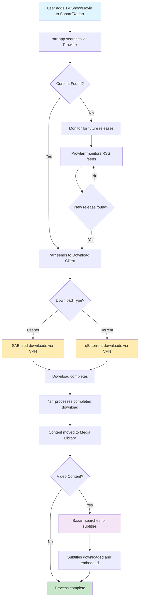
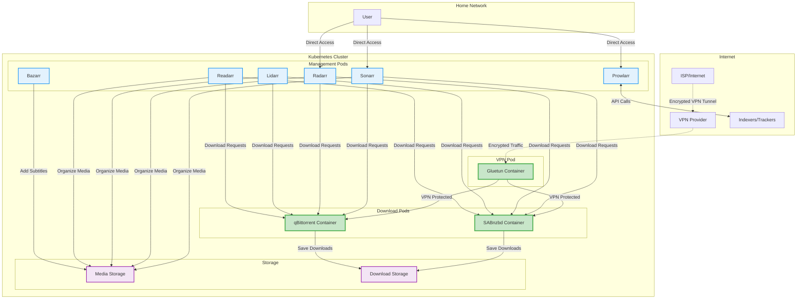

# Media Centre Helm Chart

A comprehensive Helm chart that deploys a complete media automation stack on Kubernetes, including VPN, downloaders, and media management applications.

## Overview

This umbrella chart installs and configures the following applications:

- **Gluetun** - VPN client to secure download traffic
- **SABnzbd** - Usenet downloader
- **qBittorrent** - Torrent downloader
- **Prowlarr** - Indexer manager and proxy
- **Sonarr** - TV show management
- **Radarr** - Movie management
- **Lidarr** - Music management
- **Readarr** - Book/eBook management
- **Bazarr** - Subtitle management

Each application includes optional monitoring via Exportarr for Prometheus metrics.

## Architecture

The following diagram shows how all components work together in the media automation stack:


### Component Relationships

| Component | Purpose | Communicates With |
|-----------|---------|-------------------|
| **Gluetun** | VPN gateway protecting download traffic | Internet, SABnzbd, qBittorrent |
| **Prowlarr** | Indexer management and API proxy | External indexers, all *arr apps |
| **SABnzbd** | Usenet (NZB) downloader | Gluetun (via VPN), all *arr apps |
| **qBittorrent** | Torrent downloader | Gluetun (via VPN), all *arr apps |
| **Sonarr** | TV show automation | Prowlarr, downloaders, shared storage |
| **Radarr** | Movie automation | Prowlarr, downloaders, shared storage |
| **Lidarr** | Music automation | Prowlarr, downloaders, shared storage |
| **Readarr** | Book automation | Prowlarr, downloaders, shared storage |
| **Bazarr** | Subtitle management | Sonarr, Radarr, shared storage |
| **Exportarr** | Metrics exporter | All *arr apps, Prometheus |

### Data Flow

1. **Discovery**: Prowlarr manages indexer connections and provides search capabilities
2. **Search**: Media management apps (*arr) search through Prowlarr for content
3. **Download**: Download requests are sent to SABnzbd or qBittorrent via VPN
4. **Processing**: Downloaded content is processed and moved to appropriate media directories
5. **Enhancement**: Bazarr adds subtitles to video content post-processing
6. **Monitoring**: Exportarr collects metrics from all applications for observability

### Workflow Process

The following diagram illustrates the typical user workflow and automated processes:



### User Journey Steps

1. **Initial Setup**: Configure indexers in Prowlarr, set up download clients
2. **Content Request**: Add desired TV shows/movies to Sonarr/Radarr
3. **Automated Search**: Applications automatically search for content via Prowlarr
4. **Secure Download**: Content is downloaded through VPN-protected clients
5. **Processing**: Files are organized, renamed, and moved to media libraries
6. **Enhancement**: Subtitles are automatically added to video content
7. **Monitoring**: Track system health and download statistics via metrics

### Network Security Architecture

The following diagram shows how VPN protection secures download traffic:



#### Security Benefits

- **Download Traffic Protection**: All download traffic (SABnzbd, qBittorrent) routes through VPN
- **IP Masking**: Your real IP address is hidden from indexers and trackers
- **ISP Privacy**: Download activity is encrypted and hidden from your ISP
- **Kill Switch**: If VPN disconnects, download clients lose internet access
- **Split Tunneling**: Management interfaces remain directly accessible for configuration

#### Network Isolation Levels

| Component | Network Access | Security Level |
|-----------|---------------|----------------|
| **Download Clients** | VPN Only | 🔒 High - All traffic encrypted |
| **Management Apps** | Direct + Internal | 🔓 Medium - Local cluster access |
| **Storage** | Internal Only | 🔒 High - No external access |
| **VPN Gateway** | Internet + VPN | 🔒 High - Encrypted tunnel |

## Prerequisites

- Kubernetes 1.19+
- Helm 3.2.0+
- A storage class that supports `ReadWriteMany` access mode for shared media storage
- VPN credentials (if using Gluetun)

## Installation

### Add the Helm Repository

```bash
helm repo add your-charts https://your-org.github.io/charts
helm repo update
```

### Install the Chart

```bash
# Basic installation with default values
helm install media-centre your-charts/media-centre

# Install with custom values
helm install media-centre your-charts/media-centre -f values.yaml

# Install in a specific namespace
helm install media-centre your-charts/media-centre --namespace media --create-namespace
```

## Configuration

### Global Configuration

| Parameter | Description | Default |
|-----------|-------------|---------|
| `global.storageClass` | Default storage class for all PVCs | `""` |
| `global.media.enabled` | Enable shared media storage | `true` |
| `global.media.size` | Size of shared media storage | `1Ti` |
| `global.media.storageClass` | Storage class for media volumes | `""` |
| `global.downloads.enabled` | Enable shared downloads storage | `true` |
| `global.downloads.size` | Size of downloads storage | `500Gi` |
| `global.network.useVPN` | Route download clients through VPN | `true` |

### VPN Configuration (Gluetun)

| Parameter | Description | Default |
|-----------|-------------|---------|
| `gluetun.enabled` | Enable Gluetun VPN | `true` |
| `gluetun.env.VPN_SERVICE_PROVIDER` | VPN provider | `nordvpn` |
| `gluetun.env.VPN_TYPE` | VPN protocol type | `openvpn` |
| `gluetun.env.OPENVPN_USER` | VPN username | `""` |
| `gluetun.env.OPENVPN_PASSWORD` | VPN password | `""` |

### Application Configuration

Each application can be enabled/disabled and configured independently:

| Parameter | Description | Default |
|-----------|-------------|---------|
| `<app>.enabled` | Enable the application | `true` |
| `<app>.image.repository` | Container image repository | `lscr.io/linuxserver/<app>` |
| `<app>.image.tag` | Container image tag | `latest` |
| `<app>.env.TZ` | Timezone | `UTC` |
| `<app>.env.PUID` | User ID | `1000` |
| `<app>.env.PGID` | Group ID | `1000` |
| `<app>.exportarr.enabled` | Enable monitoring | `true` |

## Quick Start Examples

### Basic Installation

```yaml
# values.yaml
global:
  storageClass: "fast-ssd"
  media:
    size: 2Ti
  downloads:
    size: 1Ti

gluetun:
  env:
    VPN_SERVICE_PROVIDER: "nordvpn"
    OPENVPN_USER: "your-username"
    OPENVPN_PASSWORD: "your-password"
```

### Disable Specific Applications

```yaml
# values.yaml
# Only install downloaders and TV/Movie management
lidarr:
  enabled: false
readarr:
  enabled: false
bazarr:
  enabled: false
```

### Custom Storage Configuration

```yaml
# values.yaml
global:
  media:
    existingClaim: "existing-media-pvc"
  downloads:
    existingClaim: "existing-downloads-pvc"

sonarr:
  persistence:
    media:
      existingClaim: "tv-shows-pvc"

radarr:
  persistence:
    media:
      existingClaim: "movies-pvc"
```

### Without VPN

```yaml
# values.yaml
global:
  network:
    useVPN: false

gluetun:
  enabled: false

# Remove VPN annotations from downloaders
sabnzbd:
  podAnnotations: {}

qbittorrent:
  podAnnotations: {}
```

## Post-Installation Setup

### 1. Access Applications

After installation, each application will be available at its service port:

- **Gluetun**: `http://<cluster-ip>:8000`
- **SABnzbd**: `http://<cluster-ip>:8080`
- **qBittorrent**: `http://<cluster-ip>:8080`
- **Prowlarr**: `http://<cluster-ip>:9696`
- **Sonarr**: `http://<cluster-ip>:8989`
- **Radarr**: `http://<cluster-ip>:7878`
- **Lidarr**: `http://<cluster-ip>:8686`
- **Readarr**: `http://<cluster-ip>:8787`
- **Bazarr**: `http://<cluster-ip>:6767`

### 2. Configure Indexers

1. Set up indexers in **Prowlarr** first
2. Use Prowlarr's integration to automatically configure indexers in other applications

### 3. Configure Download Clients

1. In each *arr application, add download clients:
   - **SABnzbd**: `http://sabnzbd:8080`
   - **qBittorrent**: `http://qbittorrent:8080`

### 4. Set Up Media Directories

Configure consistent media paths across applications:
- **TV Shows**: `/tv`
- **Movies**: `/movies`
- **Music**: `/music`
- **Books**: `/books`

## Monitoring

Each application includes optional Exportarr monitoring that exports metrics to Prometheus:

```yaml
# Enable monitoring for all applications
sonarr:
  exportarr:
    enabled: true

radarr:
  exportarr:
    enabled: true
# ... etc
```

Metrics are available at `http://<app>:9707/metrics`

## Storage Considerations

### Shared Storage

The chart is designed to work with shared storage (ReadWriteMany) for media files, allowing multiple applications to access the same media library.

### Storage Classes

Consider using different storage classes for different types of data:
- Fast SSD for application configs and databases
- Slower bulk storage for media files
- High-performance storage for download directories

## Security Considerations

### VPN Configuration

- Always use a VPN for download clients to protect privacy
- Store VPN credentials in Kubernetes secrets
- Configure VPN kill-switch to prevent traffic leakage

### Network Policies

Consider implementing network policies to:
- Isolate download clients to VPN-only traffic
- Restrict management application access
- Control inter-application communication

## Troubleshooting

### Common Issues

1. **Applications can't reach each other**
   - Check service names and ports
   - Verify network policies aren't blocking traffic

2. **Storage permission issues**
   - Ensure PUID/PGID match filesystem permissions
   - Check storage class supports required access modes

3. **VPN connectivity issues**
   - Verify VPN credentials
   - Check Gluetun logs for connection status
   - Ensure port forwarding is configured correctly

### Checking Logs

```bash
# Check application logs
kubectl logs -f deployment/sonarr -n media

# Check VPN logs
kubectl logs -f deployment/gluetun -n media

# Check all pods in namespace
kubectl get pods -n media
```

## Upgrading

### Backup Before Upgrading

Always backup your configuration before upgrading:

```bash
# Backup persistent volumes
kubectl get pvc -n media

# Export current values
helm get values media-centre -n media > backup-values.yaml
```

### Upgrade Process

```bash
# Update repository
helm repo update

# Upgrade chart
helm upgrade media-centre your-charts/media-centre -f values.yaml -n media
```

## Uninstallation

```bash
# Uninstall the chart
helm uninstall media-centre -n media

# Optionally remove persistent volumes
kubectl delete pvc -l app.kubernetes.io/instance=media-centre -n media
```

## Contributing

Please see the [CONTRIBUTING.md](../../../CONTRIBUTING.md) file for details on how to contribute to this chart.

## License

This chart is licensed under the [LICENSE](../../../LICENSE) file in the repository root.